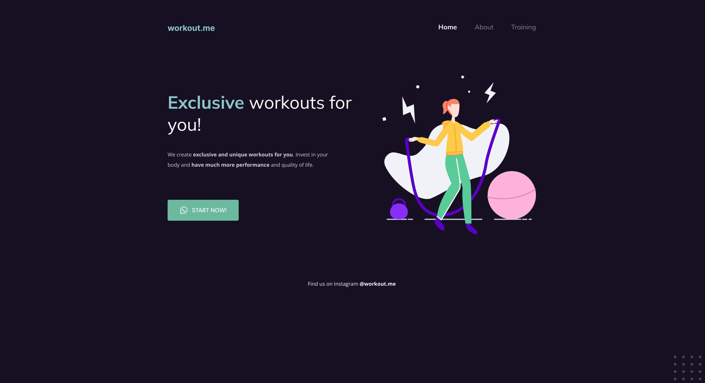

# Rocketseat Project 02

This project was developed during Stage 2 of Rocketseat's Explorer course. It was created to demonstrate skills acquired with the use of the main concepts of HTML5 and CSS3, seen during the classes.

## Demo

[Frontend - Deployment](https://emidiovaleretto.github.io/rocketseat-project-02/)